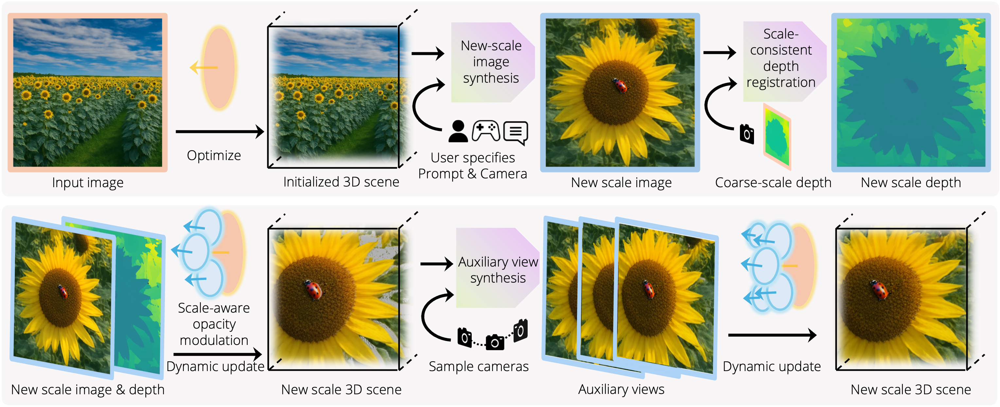

<p align="center">
    
</p>

# WonderZoom: Multi-Scale 3D World Generation

<div align="center">

[](https://wonderzoom.github.io/)
[](https://arxiv.org/abs/2512.09164)
[](https://huggingface.co/datasets/TmaKiss/WonderZoom)

</div>


> **WonderZoom: Multi-Scale 3D World Generation**
>
> [Jin Cao*](https://jin-cao-tma.github.io/), [Koven Yu*](https://kovenyu.com/), [Jiajun Wu](https://jiajunwu.com/)
>
> (* denotes equal contribution)

## Overview

WonderZoom generates **multi-scale 3D worlds** from a single image. Starting from an input photograph, it constructs a 3D Gaussian Splatting scene that supports continuous zoom-in navigation — revealing new details and objects at each scale level.



This release includes:
- Pre-trained 3D scenes for interactive real-time viewing
- Render-only server with web-based frontend
- Full generation pipeline (coming in a future release)

## Installation

### 1. Clone the repository

```bash
git clone https://github.com/jin-cao-tma/WonderZoom.git
cd WonderZoom
```

### 2. Create conda environment

```bash
conda create -n wonderzoom python=3.10 -y
conda activate wonderzoom

# Install PyTorch (CUDA 12.1)
pip install torch==2.1.0 torchvision==0.16.0 --index-url https://download.pytorch.org/whl/cu121

# Install dependencies
pip install -r requirements.txt
```

### 3. Build custom CUDA extensions

```bash
cd submodules/depth-diff-gaussian-rasterization-min
pip install -e .
cd ../simple-knn
pip install -e .
cd ../..
```

### 4. Install PyTorch3D

```bash
pip install "git+https://github.com/facebookresearch/pytorch3d.git@stable"
```

### 5. Download pre-trained scenes

Download the `.pth` files from our [HuggingFace dataset](https://huggingface.co/datasets/TmaKiss/WonderZoom) and place them in the `gaussian/` directory:

```bash
# Using huggingface-cli
pip install huggingface_hub
huggingface-cli download TmaKiss/WonderZoom --repo-type dataset --local-dir ./
```

Or download individual scenes:

```python
from huggingface_hub import hf_hub_download

scenes = [
    "gau_bird3_complete1080.pth",    # street scene
    "gau_fish1_complete1080.pth",    # coral reef
    "gau_beetle1_complete1080.pth",  # tree / beetle
    "gau_conch1_complete1080.pth",   # beach
    "gau_lizard_complete1080.pth",   # wooden wall / lizard
    "gau_ladybug1_complete1080.pth", # sunflower / ladybug
    "gau_butterfly_complete1080.pth",# tea garden / butterfly
    "gau_butterfly_complete.pth",    # tea garden (480p)
    "gau_conch_complete.pth",        # beach (480p)
    "gau_lego_complete.pth",         # lego (480p)
]

for scene in scenes:
    hf_hub_download(
        repo_id="TmaKiss/WonderZoom",
        repo_type="dataset",
        filename=f"gaussian/{scene}",
        local_dir="./",
    )
```

## Quick Start

### Run the render server

```bash
conda activate wonderzoom

# Pick a scene config
python run_render_only.py --example_config ./config/more_examples/street.yaml --port 7747
```

Available scene configs:

| Config | Scene | Resolution |
|--------|-------|-----------|
| `street.yaml` | City street with bird | 720x1080 |
| `fish.yaml` | Coral reef with fish | 720x1080 |
| `tree.yaml` | Lakeside tree with beetle | 720x1080 |
| `beach.yaml` | Beach with conch shell | 720x1080 |
| `sunflower.yaml` | Sunflower field with ladybug | 720x1080 |
| `wooden.yaml` | Wooden wall with lizard | 720x1080 |
| `tea_garden.yaml` | Tea garden with butterfly | 720x1080 |
| `lego.yaml` | Lego scene | 480x720 |
| `beach2.yaml` | Beach (480p) | 480x720 |
| `tea_garden2.yaml` | Tea garden (480p) | 480x720 |

You can also specify a `.pth` file directly:

```bash
python run_render_only.py --pth_path ./gaussian/gau_bird3_complete1080.pth \
    --example_config ./config/more_examples/street.yaml --port 7747
```

**Streaming quality:** If the viewer feels laggy over SSH, you can reduce the streaming quality by editing these two lines at the top of `run_render_only.py`:

```python
IMAGE_COMPRESSION_QUALITY = 80   # lower (e.g. 20) = faster but blurrier
MAX_IMAGE_SIZE = 1080            # lower (e.g. 512) = faster streaming
```

### Connect the frontend

If running on a remote server, set up SSH port forwarding:

```bash
ssh -L 7747:localhost:7747 <your-server>
```

Then open `splat-main/index_stream.html` in your browser.

### Controls

| Key | Action |
|-----|--------|
| W / A / S / D | Rotate camera |
| ↑ / ↓ / ← / → | Move camera |
| V | Zoom in |
| B | Zoom out |
| Space | Orbit rotation |

## Project Structure

```
WonderZoom/
├── run_render_only.py          # Render server (load .pth + real-time 3DGS rendering)
├── config/
│   ├── base-config.yaml        # Base configuration
│   └── more_examples/          # Per-scene configs
├── gaussian/                   # Pre-trained .pth files (download from HuggingFace)
├── gaussian_renderer/          # 3D Gaussian Splatting renderer
├── scene/                      # GaussianModel and camera definitions
├── models/                     # Point cloud processing models
├── splat-main/                 # Web frontend viewer
├── submodules/                 # Custom CUDA extensions
│   ├── depth-diff-gaussian-rasterization-min/
│   └── simple-knn/
├── util/                       # Utility functions
└── utils/                      # Loss functions and general utilities
```

## Citation

```
@misc{wonderzoom,
    title={WonderZoom: Multi-Scale 3D World Generation},
    author={Jin Cao and Hong-Xing Yu and Jiajun Wu},
    year={2025},
    eprint={2512.09164},
    archivePrefix={arXiv},
    primaryClass={cs.CV},
    url={https://arxiv.org/abs/2512.09164}
}
```

## TODO

- [x] Release rendering and interactive visualization code
- [ ] Release Chain-of-Zoom integration for multi-scale zoom-in generation
- [ ] Release Gen3C integration for high-quality novel view synthesis
- [ ] Release Step1X-Edit integration for object editing

## Related Project

- [CVPR2025 Highlight] [**WonderWorld**: Interactive 3D Scene Generation from a Single Image](https://kovenyu.com/wonderworld/)

## Acknowledgement

We appreciate the authors of the following projects for sharing their code:
[3D Gaussian Splatting](https://github.com/graphdeco-inria/gaussian-splatting),
[MoGe](https://github.com/microsoft/MoGe),
[GeometryCrafter](https://github.com/TencentARC/GeometryCrafter),
[Marigold](https://github.com/prs-eth/Marigold),
[OneFormer](https://github.com/SHI-Labs/OneFormer),
[RepViT-SAM](https://github.com/THU-MIG/RepViT),
[PyTorch3D](https://github.com/facebookresearch/pytorch3d),
[Chain-of-Zoom](https://github.com/TODO/Chain-of-Zoom),
[Gen3C](https://github.com/NVlabs/Gen3C),
[Step1X-Edit](https://github.com/TODO/Step1X-Edit),
[Stable Diffusion](https://huggingface.co/stabilityai/stable-diffusion-2-inpainting),
[VGGT](https://github.com/facebookresearch/vggt),
[Kornia](https://github.com/kornia/kornia),
and [INR-Harmonization](https://github.com/zhengchen1999/INR-Harmonization).
