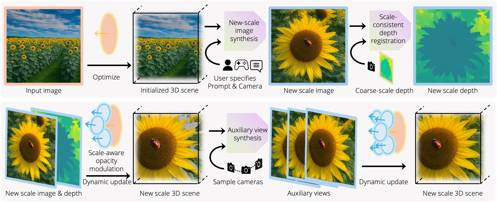

<p align="center">
    
</p>

# WonderZoom: Multi-Scale 3D World Generation

<div align="center">

[](https://wonderzoom.github.io/)
[](https://arxiv.org/abs/2512.09164)
[](https://huggingface.co/datasets/TmaKiss/WonderZoom)

</div>


> **WonderZoom: Multi-Scale 3D World Generation**
>
> [Jin Cao*](https://jin-cao-tma.github.io/), [Koven Yu*](https://kovenyu.com/), [Jiajun Wu](https://jiajunwu.com/)
>
> (* denotes equal contribution)

## Overview

WonderZoom generates **multi-scale 3D worlds** from a single image. Starting from an input
photograph, it builds a 3D Gaussian Splatting scene that supports continuous zoom-in navigation,
revealing new details and objects at each scale.



The scene is made of scale-adaptive Gaussian surfels: each primitive knows the scale it was
generated at, and the renderer fades it in and out with the viewing scale. A progressive detail
synthesizer grows the scene interactively:
- **zoom-in** adds finer-scale content with [Chain-of-Zoom](https://github.com/bryanswkim/Chain-of-Zoom)
  super-resolution and scale-consistent depth registration;
- **camera moves** and **auxiliary views** extend the scene with [Gen3C](https://github.com/nv-tlabs/GEN3C)
  videos;
- **object insertion** (optional) places new objects at a new scale with [Step1X-Edit](https://github.com/stepfun-ai/Step1X-Edit).

## What is released

One server, `run.py`, serves one page, `splat-main/index_gen.html`, at `http://localhost:7747/` in both modes.

| Mode | Entry point | What you need |
|---|---|---|
| **Generation** (default): the page shows the scene live while it is generated | `run.py` (or `scripts/run_server.sh`) | four conda environments, about 168 GB of checkpoints and a large GPU (see [Hardware](#hardware-requirements)) |
| **Viewing** a released or saved scene: no generation model, no worker | `run.py --view` | one GPU, the `wz-main` environment and the [pre-generated scenes](https://huggingface.co/datasets/TmaKiss/WonderZoom) |

`run.py --view` replaces `run_render_only.py` and `splat-main/index_stream.html` of the first release.

The generation pipeline runs the three video and image models (Gen3C, Chain-of-Zoom and Step1X-Edit) as persistent
worker processes in their own environments. On a single 46-48 GB GPU, the default `auto` GPU policy lets the models
take turns on the GPU and parks the idle ones in host RAM. Scripts install the environments, download pinned
checkpoints and check the installation.

## License

> **Non-commercial use only.** Both viewing (`run.py --view`) and generation depend on components that
> do not allow commercial use. Read [THIRD_PARTY_LICENSES.md](THIRD_PARTY_LICENSES.md) before you use or
> redistribute the code, the weights or the generated scenes.

**WonderZoom's own code:** the license has not been chosen yet (TODO(authors)). Until the authors add a `LICENSE`
file, no license is granted for it. <!-- TODO(authors): choose the license of WonderZoom's own code and add a root LICENSE file; it must be compatible with the CC BY-NC-SA 4.0 LucidDreamer-derived files and the Inria Gaussian-Splatting License. -->

Non-commercial components:

| Component | License | Needed by |
|---|---|---|
| 3DGS rasterizer, simple-knn and the 3DGS-derived code (`submodules/`, `scene/`, `gaussian_renderer/`, parts of `utils/`) | Inria Gaussian-Splatting License: non-commercial research and evaluation | viewing and generation |
| Files derived from [LucidDreamer](https://github.com/luciddreamer-cvlab/LucidDreamer) (`utils/trajectory.py`, `utils/depth.py`, `arguments_in.py`, `scene/__init__.py`, `scene/dataset_readers.py`) | CC BY-NC-SA 4.0 ([`LICENSES/`](LICENSES/LucidDreamer-CC-BY-NC-SA-4.0.txt)): attribution, non-commercial, share-alike | viewing and generation |
| [GeometryCrafter](https://github.com/TencentARC/GeometryCrafter) code and weights | GeometryCrafter license: academic, research and education only | generation |
| [Stable Diffusion 3 Medium](https://huggingface.co/stabilityai/stable-diffusion-3-medium-diffusers) (diffusers, gated) | Stability AI Non-Commercial Research Community License | generation (zoom-in) |
| [Qwen2.5-VL-3B-Instruct](https://huggingface.co/Qwen/Qwen2.5-VL-3B-Instruct) | Qwen Research License (non-commercial) | generation (zoom-in) |

Other terms to be aware of:
- **Gen3C guardrail.** The Gen3C-Cosmos-7B and Cosmos tokenizer weights are under the NVIDIA Open Model License,
  whose rights terminate if the model's safety guardrails are disabled. WonderZoom runs Gen3C **with the guardrail
  disabled by default**, as in the paper runs (`services.gen3c.disable_guardrail: true` in
  `config/services.yaml`). Set it to `false` to run the guardrail; see
  [THIRD_PARTY_LICENSES.md](THIRD_PARTY_LICENSES.md#nvidia-open-model-license-and-the-gen3c-guardrail).
- Stable Video Diffusion img2vid-xt (GeometryCrafter's base model) is under the Stability AI Community License.
  Stable Diffusion 2 inpainting (object insertion) is under CreativeML Open RAIL++-M, which has use-based
  restrictions.

## Quick start: view a released scene

**1. Install the main environment.** It builds PyTorch3D and the 3DGS CUDA extensions, which takes about 30-60 min
on 16 CPUs.

```bash
git clone https://github.com/jin-cao-tma/WonderZoom.git && cd WonderZoom
bash scripts/install_env_main.sh          # creates the conda env wz-main
conda activate wz-main
```

**2. Download the pre-generated scenes** (~7.8 GB) into `gaussian/`:

```bash
bash scripts/download_checkpoints.sh --scenes
# or, with the Hugging Face CLI:
huggingface-cli download TmaKiss/WonderZoom --repo-type dataset --include "gaussian/*.pth" --local-dir ./
```

**3. Start the server in view mode:**

```bash
python run.py --view --example_config config/more_examples/street.yaml
```

`--view` loads the scene file of the config (`pth_path`), renders it at the config's `orig_H` x `orig_W` (else
`gen_H` x `gen_W`) and uses the config's orbit code for Space. It loads no generation model and starts no worker.
Start-up takes about 35 s for the largest released scene.

| Config | Scene | Resolution |
|--------|-------|-----------|
| `street.yaml` | City street with bird | 720x1080 |
| `fish.yaml` | Coral reef with fish | 720x1080 |
| `tree.yaml` | Lakeside tree with beetle | 720x1080 |
| `beach.yaml` | Beach with conch shell | 720x1080 |
| `sunflower.yaml` | Sunflower field with ladybug | 720x1080 |
| `wooden.yaml` | Wooden wall with lizard | 720x1080 |
| `tea_garden.yaml` | Tea garden with butterfly | 720x1080 |
| `lego.yaml` | Lego scene | 480x720 |
| `beach2.yaml` | Beach (480p) | 480x720 |
| `tea_garden2.yaml` | Tea garden (480p) | 480x720 |

You can also pass a `.pth` file directly (`--pth_path` implies `--view`):

```bash
python run.py --view --pth_path ./gaussian/gau_bird3_complete1080.pth \
    --example_config config/more_examples/street.yaml
```

Add `--dry_run` to print the resolved scene path, render size and stream settings and exit before loading the scene.

**Streaming quality:** view mode streams JPEG frames of quality 80, at most 1080 px on the longest edge
(`--stream_quality 80 --stream_max_size 1080`). If the viewer lags over SSH, lower them, e.g.
`--stream_max_size 512 --stream_quality 40`.

**4. Open the page.** The server binds to `127.0.0.1:7747`. If it is remote, forward the port first:

```bash
ssh -N -L 7747:localhost:7747 <your-server>
```

Then open `http://localhost:7747/`. Pass `--host 0.0.0.0` to serve other machines directly. The page also works as
a local file: `splat-main/index_gen.html?server=localhost:7747`.

In view mode the page is titled "WonderZoom Viewer", hides the generation controls and shows `idle` with
`Viewing <file>` in the status line. Generation keys are refused; start `run.py` without `--view` to generate.
Stop the server with Ctrl+C.

| Key | Action |
|-----|--------|
| W / A / S / D | Rotate camera |
| ↑ / ↓ / ← / → | Move camera |
| V | Zoom in |
| B | Zoom out |
| Space | Orbit rotation |

## Quick start: generation

```bash
# 1. Clone
git clone https://github.com/jin-cao-tma/WonderZoom.git && cd WonderZoom

# 2. Build the environments wz-main, wz-gen3c and wz-coz (add --objects for object insertion: wz-step1x + GroundedSAM)
bash scripts/install_all.sh [--objects]

# 3. Accept the SD3-Medium license (Stability AI Non-Commercial Research Community License) on
#    https://huggingface.co/stabilityai/stable-diffusion-3-medium-diffusers, then log in
conda activate wz-main && huggingface-cli login      # or: export HF_TOKEN=hf_...

# 4. Download the checkpoints: the groups for the three default environments (~111 GB) ...
bash scripts/download_checkpoints.sh --core --gen3c --coz
#    ... or everything, including object insertion (~168 GB)
# bash scripts/download_checkpoints.sh --all

# 5. On a GPU node, check every registered environment (add --objects after install_all.sh --objects)
python scripts/check_install.py

# 6. Start the server
bash scripts/run_server.sh --example_config config/more_examples/street.yaml
```

The server binds to `127.0.0.1:7747`. Forward the port from your laptop and open the generation UI:

```bash
ssh -L 7747:localhost:7747 <your-server>     # then open http://localhost:7747/
```

The status line at the top of the page reports progress. The main models load first. The model workers then
start in the background while the initial scene is built, and the status becomes `idle` once the server accepts
requests. A request that needs a worker that is still loading waits for it. Every session is written to
`runs/<example_name>/<YYYYmmdd-HHMMSS>/`.

To generate from your own image, run `bash scripts/run_server.sh --image /path/to/photo.jpg --name my_scene`.
Relative paths are resolved against your current directory first, then against the repository root.

Details: [docs/INSTALL.md](docs/INSTALL.md) for environments and troubleshooting,
[docs/GENERATION_GUIDE.md](docs/GENERATION_GUIDE.md) for workflows and configuration.

### Key map (generation UI)

| Key | Action |
|-----|--------|
| W / A / S / D | Rotate camera (pitch / yaw) |
| ↑ / ↓ / ← / → | Move forward / back / left / right |
| N / M | Move down / up |
| V / B | Zoom in / out (focal length ×1.05 per press; B stops at the initial focal length) |
| H | Add the current view as a trajectory point (zoom-in: press once at the start view) |
| J | Clear the trajectory |
| R | Generate to the current view: zoomed in = zoom-in generation (Chain-of-Zoom), otherwise camera move (Gen3C) |
| Q | Toggle rewrite / overwrite mode for zoom-in (default: rewrite) |
| Space | Orbit preview (no scene change) |
| Ctrl + Shift + Space | High-quality orbit refinement with Gen3C (auxiliary views) |
| Ctrl + Alt + Space | Fix small cracks |
| P | Complete the background behind objects in the current view (only with object insertion) |
| Z | Undo the last generation (one level) |
| X | Save the scene to `<session>/scenes/<example_name>_<NNN>.pth` |
| C | Delete the Gaussians visible in the current view |

Object insertion: type an object (e.g. `a ladybug`) into the box at the top of the page and press Enter. The
object is inserted at the end of the next zoom-in.

### Viewing a saved scene

**X** saves the scene in the same format as the released scenes, so `run.py --view` can load it. Pass the
session's `config.yaml` as the scene config: it records the generation resolution and the scene's orbit code.
Run it in the `wz-main` environment, on another port if the generation server is still running:

```bash
python run.py --view --pth_path runs/street/<YYYYmmdd-HHMMSS>/scenes/street_000.pth \
    --example_config runs/street/<YYYYmmdd-HHMMSS>/config.yaml --port 7748
```

Then forward port 7748 and open `http://localhost:7748/`. See
[Viewing saved scenes](docs/GENERATION_GUIDE.md#viewing-saved-scenes) and, for `.splat` export,
`tools/export_splat.py`.

## Documentation

- [docs/INSTALL.md](docs/INSTALL.md): the four environments, build settings (`MAX_JOBS`, `TORCH_CUDA_ARCH_LIST`),
  checkpoints, `check_install.py` and troubleshooting.
- [docs/GENERATION_GUIDE.md](docs/GENERATION_GUIDE.md): workflows (camera move, zoom-in, object insertion, HQ views,
  crack fixing, undo/save, viewing and exporting scenes), your own images, the config reference,
  `config/services.yaml` and the GPU policies.
- [docs/HARDWARE.md](docs/HARDWARE.md): GPU memory, host RAM, disk and timings.
- [THIRD_PARTY_LICENSES.md](THIRD_PARTY_LICENSES.md): licenses of the bundled code and the downloaded models,
  including non-commercial terms.

## Hardware requirements

| | Viewing (`run.py --view`) | Generation |
|---|---|---|
| GPU | one NVIDIA GPU, compute capability 8.0 / 8.6 / 8.9 / 9.0 with the default build; peak 5,258 MiB in `nvidia-smi` for the largest released scene | two GPUs with ≥46 GB (profile B, tested), or one GPU with ≥46 GB (profile A, single-GPU `exclusive` policy; tested end to end on one L40S 46 GB, peak 39,971 MiB in `nvidia-smi`) |
| Tested on | 1x NVIDIA L40S 46 GB | 2x NVIDIA L40S 46 GB: the main process on GPU 0, Gen3C, Chain-of-Zoom and Step1X-Edit taking turns on GPU 1 (`exclusive`) |
| Host RAM | about 1.3 GB RSS for the largest released scene | ≥192 GB recommended, 256 GB to be safe (idle models are parked in RAM; measured peak RSS of the server and its workers: 135 GB with object insertion); loading Gen3C alone needs ≥96 GB |
| Disk | ~7.8 GB scenes + `wz-main` (12 GB) | ~168 GB checkpoints (`--all`) + four environments (about 40 GB) |
| Time per camera move / zoom-in | n/a | measured on 2x L40S: about 16.5 min per camera move (in the test, the first move included about 3 min of waiting for the other workers to load), 1.7-2.5 min per zoom-in, 5.5 min for a zoom-in with object insertion |

See [docs/HARDWARE.md](docs/HARDWARE.md) for per-model numbers and multi-GPU profiles.

## Paper-to-code map

| Paper component | Code |
|---|---|
| Single-image initialization (depth → surfels → initial 3DGS) | `run.py` `run()`; `models/vdm_model.py` `VideoGaussianProcessor.process_single_img` (MoGe depth, OneFormer sky mask `generate_sky_mask`, Marigold normals `get_normal` in `models/models_vdm.py`); `scene/gaussian_model.py` `GaussianModel.create_from_pcd`; `run.py` `compute_3D_filter`, `train_gaussian` |
| Scale-adaptive Gaussian surfels (prior / current / next scale per primitive) | `scene/gaussian_model.py` `create_from_pcd`, `get_prior_scale_all` / `get_now_scale_all` / `get_next_scale_all`, `merge_gaussian`, `merge_gaussian_with_trainability_control`; `run.py` `setup_gaussian_scales_and_merge`; `gaussian_renderer/__init__.py` `compute_target_scale_per_frame` |
| Scale-aware opacity modulation (LOD rendering) | `gaussian_renderer/__init__.py` `render()` (`filter_scale=True`, `opt.lod_q_enable`), `compute_log_scale_weights`, `compute_inv_target_scale_per_frame` |
| Progressive detail synthesizer (zoom-in) | `run.py` zoom branch of the main loop in `run()` (49 frames from `util/utils.py` `interpolate_cameras_K`) and `process_one_seq(zoom_in=True)`; `run.py` `render_zoomin_rough_video3` (3 keyframes, `utils/zoom_utils.py` `zoom_image_by_focal_change`, two Chain-of-Zoom calls, onion-style compositing); super-resolution: `third_party/chain_of_zoom/wonderzoom_coz.py` `SimpleChainZoomModel.inference` via `services/coz.py` and `services/workers/coz_worker.py` |
| Scale-consistent depth registration (zoom-in keyframes) | `models/vdm_model.py` `process_zoomin_frames_rewrite` (`compute_scale_and_shift_full`, `finetune_depth_model`, `inpaint_nearest_bilateral_preserve`); overwrite mode (Q): `process_zoomin_frames_overwrite`, `process_zoomin_frames_overwrite_obj_mask` |
| Depth registration for camera-move videos and auxiliary views | `models/vdm_model.py` `process_video_frames`, `process_frames_inpainting`; `GeometryCrafter/geo_infer.py` `get_moge_geo_model`, `inf_geometry` |
| Scene extension by camera moves (Gen3C) | `run.py` move branch of the main loop in `run()` (121 frames from `util/utils.py` `interpolate_cameras_RT`), `render_rough_video`, `save_rough_video_frames`; `services/gen3c.py` and `services/workers/gen3c_worker.py` (`Gen3cWorker.op_generate`) |
| Auxiliary view synthesis (HQ orbit) and crack fixing | `run.py` `handle_generate_nvs_hq`, `handle_fix_small_cracks`, `generate_orbit_cameras` (or the per-scene `generate_orbit_cameras_code`), orbit capture in `render_current_scene`, processing in the main loop of `run()` |
| Semantic content / object insertion at a new scale | `run.py` `add_object_to_image` (Step1X-Edit via `services/step1x.py`, `util/gpt4.py` `generate_edit_prompt`, `util/back_ground.py` `GroundedSAMSegmentationModel`, INR harmonization, `get_pure_background` with SD2 `inpaint_background`, `models/vdm_model.py` `process_single_img_mask` and `_apply_constrained_tilt_transform`); object refresh during later zooms: `add_object_to_image_with_image`, `update_gaussian_obj` |
| Incremental scene update (train only new content) | `run.py` `train_gaussian` (`newly_added_points`, `trainable_mask`, `hq_mode`); `scene/gaussian_model.py` `set_trainable_mask`, `merge_all_to_trainable`, `set_points_label`, `get_label_mask`, `freeze_labels` |
| Interactive exploration (streaming viewer, trajectory UI) | `run.py` `render_current_scene` and the Socket.IO handlers (`handle_gen`, ...); `models/vdm_model.py` `get_camera_by_js_view_matrix`; `splat-main/main_stream.js`, `splat-main/index_gen.html` |
| Saving and viewing scenes | `run.py` `save_gaussian_with_global_labels`, `load_gaussian_with_global_labels` (`--view`); `tools/export_splat.py` |

## Project structure

```
WonderZoom/
├── run.py                   # the server (Flask + Socket.IO): generation, or --view for saved / released scenes; serves splat-main/index_gen.html
├── config/
│   ├── base-config.yaml     # every scene key with its default
│   ├── custom_template.yaml # used by run.py --image
│   ├── more_examples/       # per-scene configs
│   └── services.yaml        # model workers, GPUs, checkpoint paths
├── services/                # worker clients, GPU arbiter; services/workers/ runs inside each worker env
├── scripts/                 # install_*.sh, download_checkpoints.sh, check_install.py, run_server.sh, ...
├── third_party/             # pins.env, checksums, WonderZoom files added to the upstream clones
├── tools/export_splat.py    # export a saved scene to .splat
├── tests/                   # worker smoke tests, headless end-to-end driver
├── docs/                    # INSTALL, GENERATION_GUIDE, HARDWARE
├── THIRD_PARTY_LICENSES.md, LICENSES/   # third-party license summary and license texts
├── envs/, requirements/     # conda toolchain and pinned pip requirements (no top-level requirements.txt; use the install scripts)
├── models/, scene/, gaussian_renderer/, util/, utils/, marigold_lcm/   # WonderZoom core
├── GeometryCrafter/, MoGe/, RepViT/   # vendored (trimmed) dependencies
├── submodules/              # 3DGS rasterizer and simple-knn CUDA extensions
├── splat-main/              # web page (index_gen.html, main_stream.js)
├── external/                # pinned upstream clones (created by the scripts; gitignored)
├── checkpoints/             # Gen3C, Step1X-Edit and other weights (created by the scripts; gitignored)
├── gaussian/                # released scenes (download_checkpoints.sh --scenes)
└── runs/                    # generation sessions (gitignored)
```

## Citation

```
@misc{wonderzoom,
    title={WonderZoom: Multi-Scale 3D World Generation},
    author={Jin Cao and Hong-Xing Yu and Jiajun Wu},
    year={2025},
    eprint={2512.09164},
    archivePrefix={arXiv},
    primaryClass={cs.CV},
    url={https://arxiv.org/abs/2512.09164}
}
```

## TODO

- [x] Release rendering and interactive visualization code
- [x] Release the generation pipeline (Gen3C camera moves, Chain-of-Zoom zoom-in, Step1X-Edit object insertion)

## Related Project

- [CVPR2025 Highlight] [**WonderWorld**: Interactive 3D Scene Generation from a Single Image](https://kovenyu.com/wonderworld/)

## Acknowledgement

We appreciate the authors of the following projects for sharing their code:
[3D Gaussian Splatting](https://github.com/graphdeco-inria/gaussian-splatting),
[LucidDreamer](https://github.com/luciddreamer-cvlab/LucidDreamer) (CC BY-NC-SA 4.0; several files in `utils/`,
`scene/` and `arguments_in.py` are derived from it, see [THIRD_PARTY_LICENSES.md](THIRD_PARTY_LICENSES.md)),
[WonderWorld](https://github.com/KovenYu/WonderWorld),
[MoGe](https://github.com/microsoft/MoGe),
[GeometryCrafter](https://github.com/TencentARC/GeometryCrafter),
[Marigold](https://github.com/prs-eth/Marigold),
[OneFormer](https://github.com/SHI-Labs/OneFormer),
[RepViT-SAM](https://github.com/THU-MIG/RepViT),
[PyTorch3D](https://github.com/facebookresearch/pytorch3d),
[Chain-of-Zoom](https://github.com/bryanswkim/Chain-of-Zoom),
[Gen3C](https://github.com/nv-tlabs/GEN3C),
[Step1X-Edit](https://github.com/stepfun-ai/Step1X-Edit),
[Stable Diffusion](https://github.com/Stability-AI/stablediffusion),
[Grounded-Segment-Anything](https://github.com/IDEA-Research/Grounded-Segment-Anything),
[VGGT](https://github.com/facebookresearch/vggt),
[Kornia](https://github.com/kornia/kornia),
and [INR-Harmonization](https://github.com/WindVChen/INR-Harmonization).
